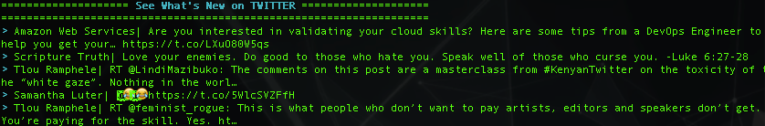

# Twitterbot
A Twitter application using the "tweepy" Python library to automate reading and sending tweets.

To use the Twitter API the bot needs to authenticate against Twitter. For that, tweepy uses the OAuth authentication standard.
You can get credentials by creating a new application at https://apps.twitter.com/.
Pleas note you will have to provide motivation to Twitter in order to use there API. ("Good Luck")

Tasks
* Create a new Twitter application
* Install the tweepy module.
* Replace values "your_consumer_key", "your_consumer_key_secret" "your_access_token", "your_access_token_secret" with your cridentials.
* Run :)

# Additional Modules:

* _future _

The __future__ module lets you import functionality from future versions of Python. Read More: [https://docs.python.org/2/library/__future__.html]
* emoji

Emoji for Python. Because Emoji's are Cool. Read more: [https://pypi.org/project/emoji/]
